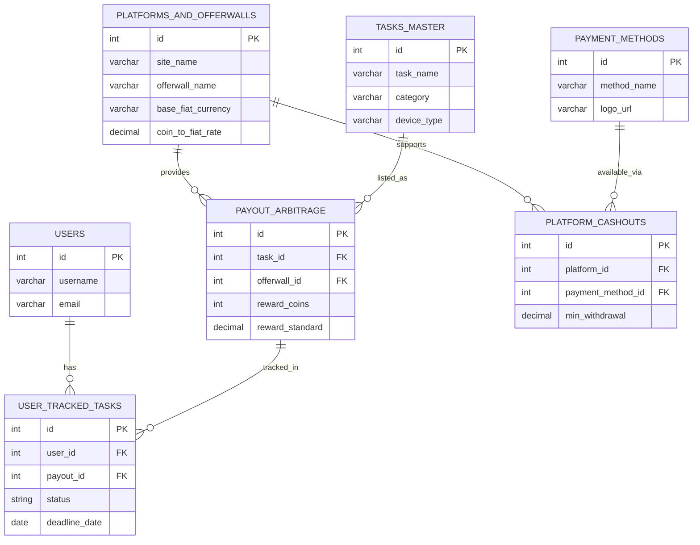

# Arbitask: Database Architecture & ERD

**Project:** Arbitask (Offerwall Aggregator & Arbitrage Tracker)  
**Document Type:** Database Schema & Data Dictionary  
**Status:** Architecture Planning

## 📌 Deskripsi Sistem

Dokumen ini mendefinisikan arsitektur basis data relasional untuk sistem **Arbitask**. Sistem ini dirancang untuk menangani agregasi data offerwall, standardisasi nilai tukar (fiat/crypto), dan pelacakan komparasi arbitrase. Skema ini telah dinormalisasi hingga tahap _Third Normal Form (3NF)_ untuk memastikan integritas data dan mengoptimalkan performansi kueri.

---

## 🗄️ Kamus Data (Data Dictionary)

### 1. `users`

Entitas untuk manajemen akun dan otentikasi pengguna.
| Kolom | Tipe Data | Key | Deskripsi |
| :--- | :--- | :--- | :--- |
| `id` | INT | PK | Unique identifier |
| `username` | VARCHAR(50) | | Display name pengguna |
| `email` | VARCHAR(100) | | Email pengguna (Unique Constraint) |
| `created_at` | TIMESTAMP | | Waktu registrasi akun |

### 2. `platforms_and_offerwalls`

Entitas master untuk menyimpan data penyedia layanan GPT dan parameter konversi mata uang asli (native currency).
| Kolom | Tipe Data | Key | Deskripsi |
| :--- | :--- | :--- | :--- |
| `id` | INT | PK | Unique platform ID |
| `site_name` | VARCHAR(50) | | Nama platform (Contoh: Freecash, Swagbucks) |
| `offerwall_name` | VARCHAR(50) | | Nama penyedia offer (Contoh: RevU, ToroX) |
| `currency_name` | VARCHAR(50) | | Nama mata uang virtual (Contoh: FC Coins) |
| `base_fiat_currency`| VARCHAR(10) | | Mata uang dasar (Contoh: USD, EUR) |
| `coin_to_fiat_rate` | DECIMAL | | Rasio konversi virtual ke fiat |

### 3. `payment_methods`

Entitas master untuk opsi penarikan dana (withdrawal).
| Kolom | Tipe Data | Key | Deskripsi |
| :--- | :--- | :--- | :--- |
| `id` | INT | PK | Unique payment method ID |
| `method_name` | VARCHAR(50) | | Nama metode (Contoh: PayPal, BTC) |
| `logo_url` | VARCHAR(255)| | Path URL untuk aset visual |

### 4. `platform_cashouts`

Tabel pivot (_Many-to-Many_) yang merelasikan platform dengan metode penarikan beserta limitasi transaksinya.
| Kolom | Tipe Data | Key | Deskripsi |
| :--- | :--- | :--- | :--- |
| `id` | INT | PK | Unique relation ID |
| `platform_id` | INT | FK | Relasi ke `platforms_and_offerwalls.id` |
| `payment_method_id` | INT | FK | Relasi ke `payment_methods.id` |
| `min_withdrawal` | DECIMAL | | Batas minimum penarikan |

### 5. `tasks_master`

Katalog sentral untuk entitas task, aplikasi, atau survei.
| Kolom | Tipe Data | Key | Deskripsi |
| :--- | :--- | :--- | :--- |
| `id` | INT | PK | Unique task ID |
| `task_name` | VARCHAR(255)| | Nama spesifik task |
| `category` | VARCHAR(50) | | Kategori (Contoh: Game, Survey) |
| `device_type` | VARCHAR(50) | | Kompatibilitas OS (Android, iOS, Desktop) |
| `thumbnail_url` | VARCHAR(255)| | Path URL untuk aset gambar task |

### 6. `payout_arbitrage`

Mesin komparasi utama (_Core Engine_) yang memetakan task dengan offerwall dan menstandardisasi nilai arbitrase untuk keperluan penyortiran data.
| Kolom | Tipe Data | Key | Deskripsi |
| :--- | :--- | :--- | :--- |
| `id` | INT | PK | Unique arbitrage ID |
| `task_id` | INT | FK | Relasi ke `tasks_master.id` |
| `offerwall_id` | INT | FK | Relasi ke `platforms_and_offerwalls.id` |
| `reward_coins` | INT | | Nilai raw asset (koin virtual) |
| `reward_native` | DECIMAL | | Konversi nilai dalam bentuk fiat/crypto asli |
| `reward_standard` | DECIMAL | | Nilai terstandardisasi (USD) untuk agregasi |
| `last_updated` | TIMESTAMP | | Waktu sinkronisasi data terakhir |

### 7. `user_tracked_tasks`

Entitas _state management_ untuk melacak progres pengerjaan task oleh masing-masing pengguna.
| Kolom | Tipe Data | Key | Deskripsi |
| :--- | :--- | :--- | :--- |
| `id` | INT | PK | Unique tracking ID |
| `user_id` | INT | FK | Relasi ke `users.id` |
| `payout_id` | INT | FK | Relasi ke `payout_arbitrage.id` |
| `status` | ENUM | | Status pengerjaan ('In Progress', 'Completed', 'Expired') |
| `deadline_date` | DATE | | Tenggat waktu penyelesaian task |
| `progress_notes`| TEXT | | _Log_ catatan progres harian pengguna |

---

## 📊 Entity Relationship Diagram (ERD)

