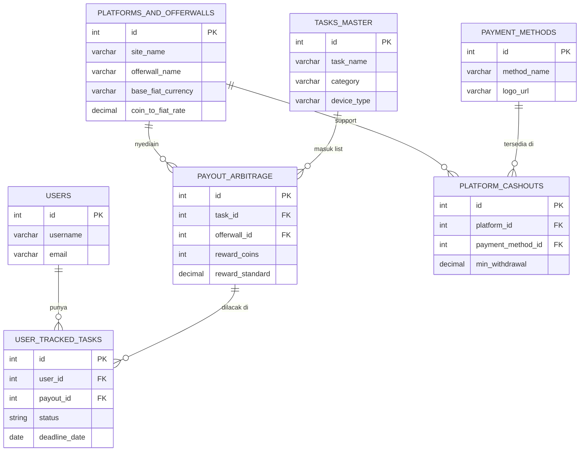

# Arbitask: Database Architecture & ERD

**Project:** Arbitask (Offerwall Aggregator & Arbitrage Tracker)  
**Author:** Farrell Shaan Deandra  
**Status:** Initial Draft

## 📌 Ringkasan

File ini berisi rancangan arsitektur database buat sistem **Arbitask**. Intinya, skema ini dipakai buat narik data, nyamain kurs, dan ngebandingin nilai task dari berbagai situs GPT (Get Paid To). Strukturnya udah dibikin pakai standar normalisasi (3NF) biar datanya rapi, nggak tumpang tindih, dan gampang di-scale ke depannya.

---

## 🗄️ Struktur Tabel (Data Dictionary)

### 1. `users`

Tabel buat nyimpen data akun pengguna yang mau pakai fitur tracker.
| Kolom | Tipe Data | Key | Keterangan |
| :--- | :--- | :--- | :--- |
| `id` | INT | PK | ID unik user |
| `username` | VARCHAR(50) | | Nama tampilan |
| `email` | VARCHAR(100) | | Email user (Unique) |
| `created_at` | TIMESTAMP | | Waktu daftar akun |

### 2. `platforms_and_offerwalls`

Daftar situs GPT dan offerwall-nya, plus data mata uang bawaan web tersebut buat keperluan konversi.
| Kolom | Tipe Data | Key | Keterangan |
| :--- | :--- | :--- | :--- |
| `id` | INT | PK | ID unik platform |
| `site_name` | VARCHAR(50) | | Contoh: Freecash, Swagbucks |
| `offerwall_name` | VARCHAR(50) | | Contoh: RevU, ToroX |
| `currency_name` | VARCHAR(50) | | Contoh: FC Coins, SB Points |
| `base_fiat_currency`| VARCHAR(10) | | Contoh: USD, EUR |
| `coin_to_fiat_rate` | DECIMAL | | Rasio konversi koin ke fiat |

### 3. `payment_methods`

Master data buat opsi narik cuan (withdraw).
| Kolom | Tipe Data | Key | Keterangan |
| :--- | :--- | :--- | :--- |
| `id` | INT | PK | ID unik metode pembayaran |
| `method_name` | VARCHAR(50) | | Contoh: PayPal, Bitcoin, Amazon GC |
| `logo_url` | VARCHAR(255)| | Link aset gambar logonya |

### 4. `platform_cashouts` (Pivot Table)

Tabel relasi buat ngehubungin platform sama metode penarikan uangnya, lengkap sama batas minimal withdraw.
| Kolom | Tipe Data | Key | Keterangan |
| :--- | :--- | :--- | :--- |
| `id` | INT | PK | ID unik relasi |
| `platform_id` | INT | FK | Nyambung ke `platforms_and_offerwalls.id` |
| `payment_method_id` | INT | FK | Nyambung ke `payment_methods.id` |
| `min_withdrawal` | DECIMAL | | Minimal narik, contoh: 5.00 |

### 5. `tasks_master`

Katalog utama buat game atau misi yang lagi ada promonya.
| Kolom | Tipe Data | Key | Keterangan |
| :--- | :--- | :--- | :--- |
| `id` | INT | PK | ID unik task |
| `task_name` | VARCHAR(255)| | Contoh: Main Monopoly Go Level 50 |
| `category` | VARCHAR(50) | | Game, Survey, Sign-up |
| `device_type` | VARCHAR(50) | | Android, iOS, Desktop |
| `thumbnail_url` | VARCHAR(255)| | Link gambar icon gamenya |

### 6. `payout_arbitrage` (Core Engine)

Ini tabel mesin arbitrasenya. Fungsinya nyambungin task sama offerwall, terus ngitung nilai aslinya ke standar USD biar gampang disortir.
| Kolom | Tipe Data | Key | Keterangan |
| :--- | :--- | :--- | :--- |
| `id` | INT | PK | ID unik komparasi |
| `task_id` | INT | FK | Nyambung ke `tasks_master.id` |
| `offerwall_id` | INT | FK | Nyambung ke `platforms_and_offerwalls.id` |
| `reward_coins` | INT | | Jumlah koin mentah dari web |
| `reward_native` | DECIMAL | | Nilai dalam bentuk mata uang asli web (misal EUR) |
| `reward_standard` | DECIMAL | | Nilai yang udah dikonversi ke standar USD |
| `last_updated` | TIMESTAMP | | Waktu terakhir data disinkronkan |

### 7. `user_tracked_tasks`

Buat nyatet progres tiap user kalau mereka nge-track task tertentu di dashboard personalnya.
| Kolom | Tipe Data | Key | Keterangan |
| :--- | :--- | :--- | :--- |
| `id` | INT | PK | ID unik tracking |
| `user_id` | INT | FK | Nyambung ke `users.id` |
| `payout_id` | INT | FK | Nyambung ke `payout_arbitrage.id` |
| `status` | ENUM | | 'In Progress', 'Completed', 'Expired' |
| `deadline_date` | DATE | | Batas waktu pengerjaan task |
| `progress_notes`| TEXT | | Catatan progres dari user |

---

## 📊 Entity Relationship Diagram (ERD)

_Copy kode Mermaid di bawah ini buat nampilin diagram visualnya di Markdown previewer atau Mermaid Live._

